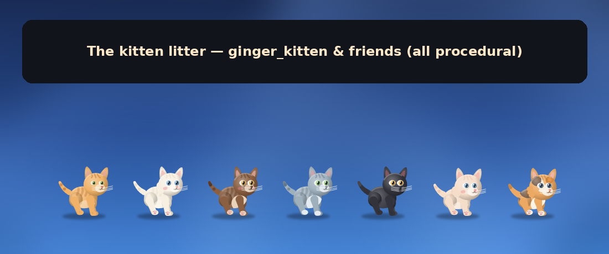
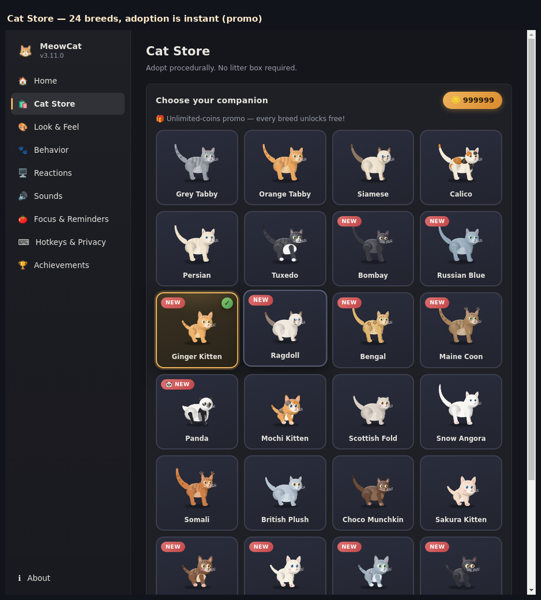
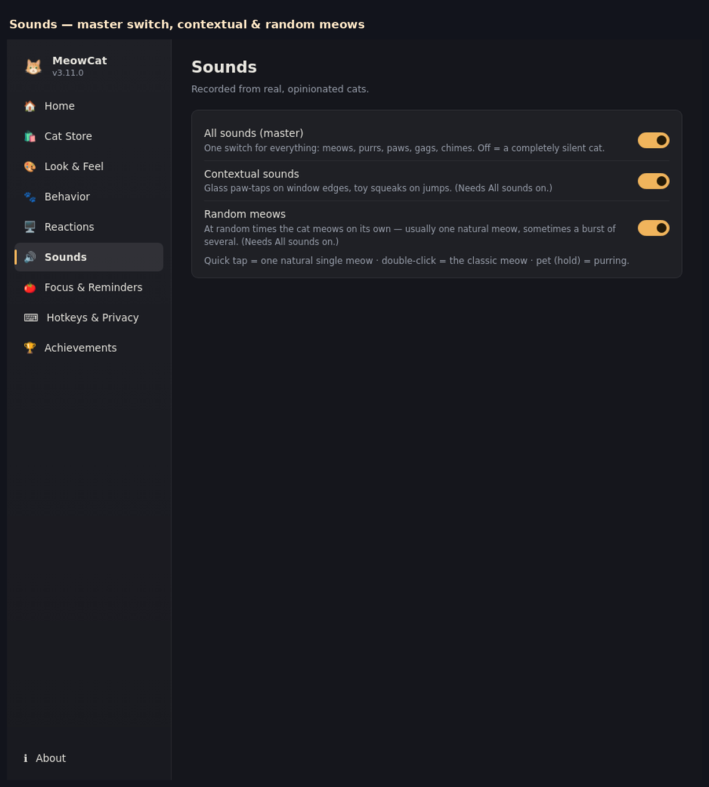
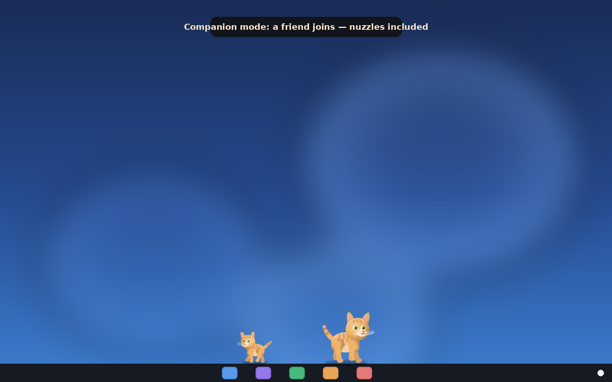
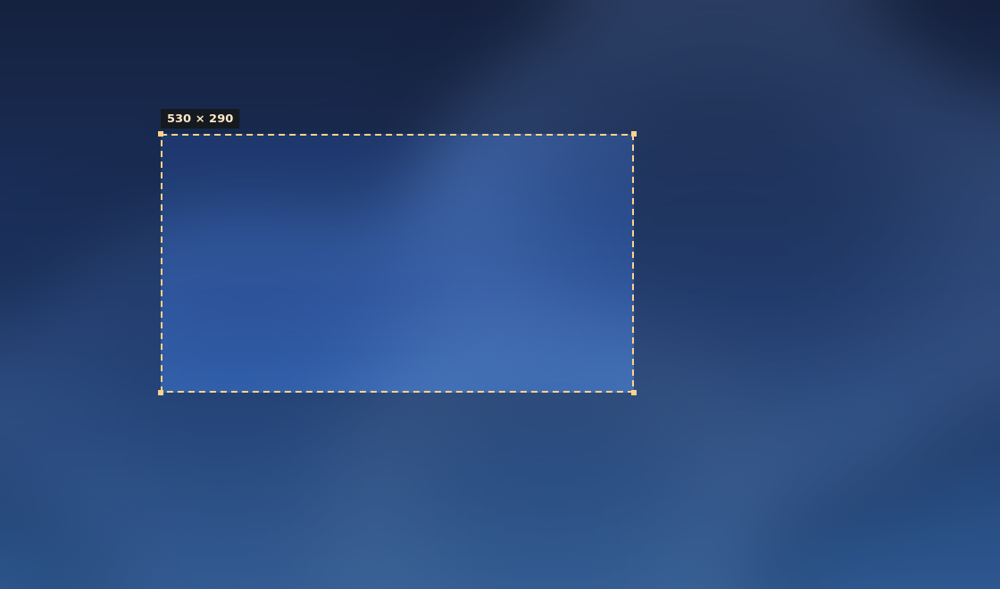

# 🐱 MeowCat

**A desktop cat for Windows 11 that thinks it lives in your computer.** It doesn't just sit on
your taskbar — it watches your CPU, hears your music, judges your build failures, and pounces on
your mouse cursor when you leave it unattended. Every pixel of the cat is drawn by pure code on a
canvas at 60 FPS — **no sprite frames, no image assets, no mercy**.


```
$ whoami
MeowCat.exe        ← in Task Manager, always. Never "electron".
```

## The default cat is the ginger kitten 🧡

Since v3.11 the cat that greets you on a fresh install is the **Ginger Kitten** — big head,
short legs, big eyes. Upgrading users get migrated to the kitten too (unless they had already
picked a breed themselves). And the kitten brought friends:



**24 breeds** in the Cat Store, including the new kitten litter: Cocoa Kitten, Milky Kitten,
Smokey Kitten, Midnight Kitten — plus Sakura, Mochi, the waddling panda and friends.



## What the cat actually does

| It can… | Details |
|---|---|
| 🚶 **Live on your windows** | Walks the taskbar, and walks & jumps along the top border of your normal (resized) windows — hopping roof-to-roof, riding along when you drag or resize a window it stands on, and politely skipping maximized full-screen ones |
| 🖥️ **Feel your machine** | CPU/RAM spike → startled panic · low battery → curls up "to save energy" · 10 PM → yawny naps · new window opens → walks over and sniffs it |
| 🎵 **Hear your music** | Bops to the beat while Spotify/YouTube plays; new track = excited hop (Windows SMTC) |
| 💻 **Judge your job** | Loafs on your code editor while you type; happy-dances when your build file goes green, mopes when it's red |
| ⌨️ **Chase your workload** | Fast typing burst → pounces toward the keyboard · mouse idle nearby → classic red-dot stalking (it remembers) |
| 🔊 **Speak cat** | Quick tap = one natural single meow · double-click = the classic meow · at random times it meows on its own — sometimes a whole burst (toggle in Settings → Sounds, with an **All sounds** master switch) |
| 🔋 **Save the planet** | Battery under 20% → curls into a ball. When you plug in, it pretends that was the plan all along |
| ❤️ **Be loved** | Pet it (hold) → purrs + affection meter → unlocks rainbow emotes and, at Lv.4, a boot-time greeting |
| 🐈 **Have friends** | Companion cat mode: nuzzling, play-fighting, and cursor-related rivalry |
| 🖱️ **Go anywhere** | Drag it across your whole desktop — including **onto your 2nd monitor** — and it stays visible the entire way |
| 📸 **Be famous** | Photo mode (Ctrl+Alt+P) freezes the pose and exports a transparent PNG sticker |
| 🏆 **Brag** | 8 achievements — "Purring Machine" (100 pets), "Dot Exterminator" (5 laser catches)… |
| 🍅 **Manage your time** | Pomodoro companion: supervises focus rounds, celebrates with a dance when you finish |
| 🎃 **Dress up** | Seasonal hats (pumpkin in October, santa in December, shades in summer) + importable JSON community skins |
| 🚫 **Respect boundaries** | No-walk zones you select straight off the screen, **Windows Snipping Tool style**: a fullscreen crosshair overlay, drag a rectangle, Esc cancels — works across every monitor |
| 🛡️ **Never vanish** | The cat NEVER hides itself and NEVER quits on its own: closed windows self-heal, a crashed renderer revives, the keyboard hook runs in a disposable sandbox process, sleep/resume revives it — only **Quit** stops it |
| 🎮 **Play** | Interactive laser-pointer chase (+3 coins per catch), ambient butterflies, zoomies, sneezes, hairballs, a bread emote for the loaf |
| ⏰ **Nag you** | Reminders & timers — the cat dances and delivers your actual message |
| 🛍️ **Get adopted** | Cat Store: 24 breeds + a panda that waddles like a real bear and eats bamboo sitting up (researched!) |

**Every feature above has an on/off toggle** in a Windows 11 Fluent-style Settings app
(left nav, cards, proper toggle switches — it looks like it ships with Windows).



## Smoothness is a feature (the anti-flicker architecture)

The overlay is a **full-width ground lane**: the cat's favorite gait — strolling along the
ground — happens inside a window that never moves. Zero `SetWindowPos` while walking means
zero flicker, by construction, not by tuning. The chase camera only wakes for the rare
vertical cases (platform climbs, rides) at a capped ≤15px/frame, and it now also follows you
**while you drag the cat**, so the sprite always has canvas under it.



No-walk zone selection looks like taking a screenshot — because it should:



## Install

1. Grab `MeowCat-3.11.0-portable.exe` from [Releases](https://github.com/mythos0/meow/releases).
2. Run it. A ginger kitten appears. That's the whole setup.
3. Right-click the cat → **Settings…**, or double-click it. Tray icon works too.
4. **Click the cat** → one natural single meow. Double-click → the classic meow + Settings.

| | |
|---|---|
| **Stack** | Electron 33 · HTML5 Canvas 2D · zero native modules required for the core |
| **Art** | 100% procedural — palettes + body skeletons + IK pose math, no PNGs |
| **Sounds** | Real recorded cats, normalized to 16-bit 44.1kHz |
| **Tests** | 288 unit + 89 visual + 163 E2E = **540 checks green** (the real app under Xvfb, every feature exercised live) |
| **RAM** | ~170 MB PSS at rest, all processes honestly named MeowCat |
| **Multi-monitor** | The cat roams the union of every display's work area — drag it to monitor 2, it walks right over |
| **Docs** | [RENDERING](docs/RENDERING.md) · [FEATURES](docs/FEATURES.md) · [BUILD](docs/BUILD.md) · [TESTING](docs/TESTING.md) |

## Community skins (no recompile!)

Drop a JSON file via **Settings → Cat Store → Import…**:

```json
{
  "name": "Nightsky",
  "base": "bombay",
  "body": "chubby",
  "colors": { "fur": "#4a4a7a", "eye": "#ffd94d", "belly": "#c8c8f0" },
  "pattern": "spots",
  "hat": "pumpkin"
}
```

It appears in the Cat Store like any breed. Ship your cat. Open a PR. Famous.

## Build from source

```bash
cd app-electron
npm install
npm start        # run the cat
npm test         # 288 unit + 89 visual checks
npm run dist     # portable Windows exe (MeowCat.exe, honestly named)
```

## Testing philosophy

The cat is 100% code, so the cat is 100% testable: the brain is a deterministic seeded state
machine (unit-tested), the renderer is a pure draw function (pixel-tested in headless Chromium),
and the full app boots under Xvfb where an E2E harness pokes *every feature* — it walks the cat
while capturing 90 consecutive frames to prove **zero flicker and zero window moves**, drags the
cat far outside the old region to prove it never disappears, draws a no-walk zone with the
screenshot-style overlay, clicks it 10 times fast to prove exactly one meow voice, launches a
second instance to prove the first survives, and closes every helper window to prove the
process never stops. All green, every release.

## License

MIT © 2026 mythos0. The cat is not licenced for use in nuclear facilities, but honestly it would
probably improve morale there too.
