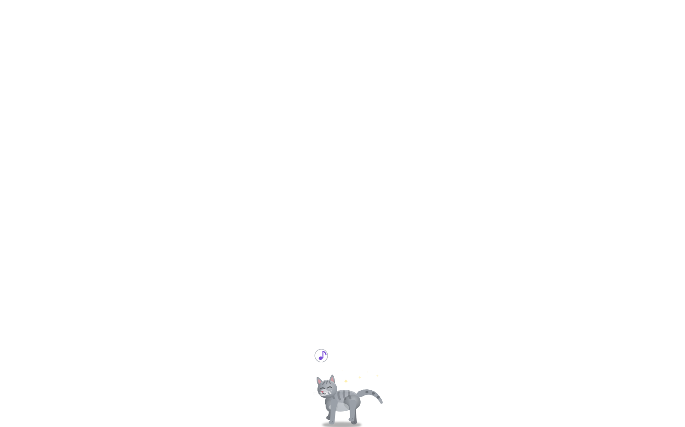
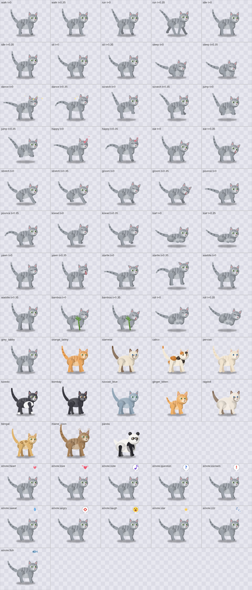

# 🐱 MeowCat

A **procedurally animated desktop cat for Windows 11** that lives *on top of everything*.
There are **zero image frames and zero art assets for the cat** — every pixel you see is drawn
in real time by pure code on an HTML canvas at 60 FPS, so it can stretch, squash, flip, change
breed, and jump onto your windows with no sprite sheets to ship, key, or break.

It walks along your taskbar, **jumps onto the top border of any nearby window, strolls along it,
and hops from window to window**, dances, naps, grooms, pounces, kneads, yawns, startles — and if
you pick the panda it waddles, somersaults, and **munches a bamboo stalk**. It has a **Cat Store**
(13 breeds · unlimited-coins promo), a **Reminders & Timers system** where the cat announces your
reminders with a speech bubble, real recorded **cat sounds**, and instant-open **Settings**
(double-click the cat).

| | |
|---|---|
| **Stack** | Electron 33 (Chromium) · HTML5 Canvas 2D · zero native modules |
| **Art** | 100% procedural vector drawing — palettes + body skeletons + pose math, no PNGs |
| **Brain** | Seeded deterministic state machine (weighted actions, window-top platform logic) |
| **Tests** | 71 unit + 60 visual (Playwright pixel analysis) + 22 E2E (real app under Xvfb) |
| **Docs** | [docs/RENDERING.md](docs/RENDERING.md) · [docs/FEATURES.md](docs/FEATURES.md) · [docs/BUILD.md](docs/BUILD.md) · [docs/TESTING.md](docs/TESTING.md) |


---

## How the cat is rendered — every detail

Everything lives in [`app-electron/src/cat-renderer.js`](app-electron/src/cat-renderer.js) — a
**pure ES module with no DOM and no Electron imports**, so the exact same code runs in the app,
in unit tests, and in headless Chromium for visual regression.

### 1. Draw is a pure function

```js
drawCat(ctx, { t, state, breed, dir, scale, alpha, jumpP })
```

Given the same inputs, the canvas receives the exact same drawing commands — nothing reads the
clock, the network, or the DOM. `t` (seconds of animation) is advanced by the brain; everything
else is configuration. This determinism is what makes the renderer unit-testable: tests render
two timestamps and assert pixels actually changed (animation is alive), render all breeds and
assert their pixel hashes differ, and assert the cat's feet stay planted near the ground line.

### 2. Coordinate system

* Feet baseline is **y = 0**, the cat faces **+x** (right); the whole scene is drawn inside
  `ctx.scale(dir * scale, scale)` so flipping/mirroring and sizing are free.
* The torso hangs at `bodyY = B.standY + poseDelta` (e.g. −46 px for a standing normal cat).
* One local unit ≈ 1 px at `scale = 1`; the app draws the cat at 0.5×–2× user setting.

### 3. Body types (`BODIES`) — the skeleton

Each breed references one of **six curated skeletons**. A skeleton is ~20 numbers:

| type | used by | character |
|---|---|---|
| `normal` | grey/orange tabby, russian blue* | balanced proportions |
| `slim` | bombay, bengal, russian blue | longer legs, narrower torso |
| `kitten` | ginger_kitten | huge head (ratio > 0.75 of body rx), short legs, stubby tail |
| `chubby` | ragdoll | round heavy torso, short thick legs |
| `large` | maine_coon | tall, long, bushy 11-segment tail |
| `panda` | panda | round belly, 4-segment stubby tail, biggest head |

(*russian blue uses slim; each skeleton defines torso radii `rx/ry`, haunch & chest ellipses,
shoulder/hip anchors, head offset + radius, leg bone lengths `legL1/legL2`, ear scale, walk
stride amplitude `footAmp`, 4 foot anchor positions, tail `{base, segs, step, r}`, standing
height `standY`, and a preview scale for the store cards.)

### 4. Palettes (`PALETTES`) — the coat

Each of the **13 breeds** is a palette: base `fur` + `dark` + `belly` + `stripe` colors,
`earIn/nose/eye/pupil/tongue` accents, plus **pattern flags** the painter interprets:

* `stripe` → 4 translucent vertical stripes on torso + forehead "M" marks
* `points` → siamese/ragdoll dark mask on muzzle + dark points/ears/tail
* `patches` → calico two-color body & head patches with radial shading
* `spots` → bengal rosettes (dark ring + warm center) on body and head
* `socks` → tuxedo white chest + white paws
* `band` + `eyePatch` + `roundEars` + `limbCol` → **panda anatomy**: white body, black
  shoulder band, black eye patches behind the eyes, round black ears, black limbs & stubby tail
* `tufts` → maine coon lynx ear tips; `fluffy` → cheek fur bumps

### 5. Paint order (layer stack)

1. **Ground shadow** — blurred dark ellipse, scales with jump height (`shadowK`)
2. **Whole-body rotation** — only for the panda somersault (`P.wholeRot`)
3. **Far legs** — drawn in a darkened fill for depth (skipped when tucked)
4. **Tail** — behind the body
5. **Body** — torso ellipse with a radial gradient (top-left highlight → base → dark rim),
   then rear-haunch and chest volume ellipses, then **breed marks clipped to the torso**,
   then a translucent rim-light arc on the back
6. **Near legs** (or tucked paw bumps for loaf/roll) — base color, drawn over the body
7. **Held prop** — the panda's bamboo stalk (gradient segments + leaves that wobble as it munches)
8. **Head** — the most detailed part (below)

### 6. Legs — 2-bone inverse kinematics

Every leg is **two tapered capsules** (shoulder→knee, knee→paw). The knee position comes from
`solveIK(hip, foot, l1, l2, bendDir)` — the classic law-of-cosines two-bone solver with clamped
reach. The walk cycle never animates joints directly: it only moves the **foot target** along a
sine path, and the IK knee follows, so gait corrections look organic for every body type.

### 7. Tail — a chained pendulum

The tail is `B.tail.segs` segments; each segment turns by `bend + sin(t·waveF + k·kw)·waveA`
and shrinks. Five motion modes (`sway/stream/spiral/curl/wrap`) are one config table each —
walking uses `sway`, running `stream` (fast small waves), dancing `spiral`, sleeping `wrap`.

### 8. Head

Skull = gradient ellipse. Then: ears (triangular for cats, circles for the panda, with twitch
micro-animation and flatten-on-startle), inner ears, lynx tufts; breed marks clipped to the
skull; eyes = white sclera + radial-gradient iris + vertical pupil + catchlight dot, with a
two-oscillator natural blink; nose; mouth in three modes (`closed`, `open`, wide-open `yawn`);
3 whiskers per side with a travelling wobble; rim light on the crown.

### 9. Animation model — `poseFor(state, t, jumpP, B)`

A pose is **pure math**: 4 foot targets, body `bobY/rot/squash`, head offset/tilt, tail mode,
eye/mouth state, particle spawner. All oscillation is `sin(t·f + phase)`; gaits are 4 legs at
phase offsets (diagonal pairs), squash-&-stretch on jumps (scale x/y inversely), and a
smoothstep rotation for the somersault. **20 states**:

`walk run idle sit sleep dance scratch jump happy eat` + v3.1:
`stretch` (downward-dog), `groom` (lick raised paw), `pounce` (butt-wiggle crouch → leap),
`knead` (making biscuits), `loaf` (legs fully tucked), `yawn`, `startle` (ears flat, puff),
+ panda-only `waddle`, `bamboo` (holds & munches a stalk), `roll` (somersault).

### 10. Emotes & particles

`drawEmote` renders **11 game-style glyphs** (heart, love, note, question, exclaim, sweat,
angry, laugh, star, zzz, fish) with a spring pop-in, gentle bob, and fade-out — text glyphs get
a white speech-badge so they read on any wallpaper. The brain attaches an emote to state
entries (`startle→!`, `dance→♪`, `sleep→Zz`, `roll→HA`, `groom→♥` …) and to interactions
(`pet→love`, `feed→fish`). Ambient particles: sparkles (dance), hearts (happy), z's (sleep),
wood chips (scratch), bamboo leaves (panda).

### 11. Why procedural? (testability + robustness)

The previous architecture shipped AI-generated sprite frames; a packaging regression silently
produced an *invisible cat* in v2.0.0. Rendering from code removed the entire asset pipeline:
there is nothing to mis-package, the EXE stays small, every breed is a data table, and **visual
regression tests can assert on geometry** (feet planted, cats distinct, animation alive,
mirror-flip symmetric) instead of eyeballing frames.

---

## Window-top hopping (v3.1 flagship behavior)

* The main process runs a **window scanner** (`src/window-scan.js`): every 2.2 s it invokes a
  PowerShell **EnumWindows** script (Win32 + DWM cloaked-window filtering — no native modules),
  parses the JSON (pure, unit-tested), filters out tiny/utility windows, and sends visible
  windows to the cat as *platforms* `{x, y, w, h}`.
* The brain (`src/cat-brain.js`) treats every window's **top border as a walkable platform**.
  While walking near one (within reach ≤ 420 px up), it launches a **directed jump**: an
  ease-out ascent onto the border, landing clamped inside the window's span. It then strolls
  along the top border, **hops to the nearest neighbouring window** at the edge (gap reach
  560 px), or drops back to the taskbar with a little forward arc. Windows that close vanish
  from the platform list and the cat lands on the ground — no crashes, no floating cats.
* Fully unit-tested with seeded RNG (`tests/platforms.test.mjs`) *and* verified live in E2E.

## Interactions

| input | action |
|---|---|
| **double-click** the cat | opens the **Settings popup instantly** (warm window pool) |
| single click | pet reaction: purr + love emote + 🪙 |
| drag & release | carries the cat; it snaps to the nearest window top or the ground |
| right-click | context menu (Settings, Reminders, Dance, Feed, Sleep, Quit) |
| tray icon | menu + left-click opens Settings |

## Settings performance (v3.1)

Settings and Reminders windows are **created hidden at startup** (`src/fast-windows.js`) and
`open` is just `show()+focus()` on an already-loaded page: **~4 ms** warm open (was seconds),
**~34 ms** reopen. Closing (X button or Close) *hides* the window instead of destroying it, so
the pool stays warm; quitting really closes everything. Note: renderer-initiated
`window.close()` destroys the window outright in Chromium, so in-page Close buttons route
through a dedicated `close-window` IPC — this detail is covered by tests.

The Settings window also carries a premium **Cat Store** (gradient cards, hover lift, golden
selected ring, NEW badges, coin pill) and an **About panel** with the version, the developer
GitHub link (`github.com/mythos0`), repo + issue links, and tech credits.

## Breeds (13) — unlimited-coins promo

grey_tabby · orange_tabby · siamese · calico · persian · tuxedo ·
**bombay** (sleek black, copper eyes) · **russian_blue** (plush blue-grey, emerald eyes) ·
**ginger_kitten** (baby proportions) · **ragdoll** (big fluffy seal-point) ·
**bengal** (golden rosettes) · **maine_coon** (huge, lynx tufts) ·
**panda** (bamboo, waddle, somersault 🐼)

`unlimitedCoins: true` is on by default: every breed unlocks **free** (the shop shows the promo
banner and no locks). Flip the flag in `settings-store.js` to re-enable the 🪙 economy — the
paid path (deduct, insufficient-funds error) is still implemented and tested.

## Reminders & timers

Full manager UI (one-shot / daily / weekly / every-N repeats, custom message and sound), a
corrupt-safe JSON store, and a scheduler that survives sleep/missed times. When one fires the
cat performs a movement, shows the label in a speech bubble, plays a chirp, and (optionally)
raises a system notification.

## Screenshots

| Live on the desktop | Premium Cat Store (13 breeds) |
|---|---|
|  |  |

| Every state × breed × emote (contact sheet) | Panda & bamboo |
|---|---|
|  |  |

---

## Install (Windows 11)

**Portable (recommended)** — download `MeowCat-3.1.0-portable.exe` and run it. Nothing to
install; a tray icon appears and the cat starts strolling. Quit from the tray menu.

**From source**

```bash
cd app-electron
npm install
npm start          # run the cat
npm test           # 71 unit + 60 visual tests
npm run dist       # MeowCat-3.1.0-portable.exe (electron-builder)
```

## Repository layout

```
app-electron/
  main.js               app lifecycle: tray, IPC, scanner, warm pool, reminders
  preload.cjs           typed contextBridge (settings, coins, reminders, platforms…)
  src/
    cat-renderer.js     pure procedural painter (palettes, bodies, poses, emotes)
    cat-brain.js        seeded state machine + platform hopping + emote triggers
    window-scan.js      PowerShell EnumWindows scanner + pure JSON parsing
    fast-windows.js     warm window pool (instant Settings/Reminders)
    settings-store.js   corrupt-safe JSON settings + coin economy
    reminder-scheduler.js  due-date engine (one-shot/daily/weekly/every-N)
    topmost.js          always-on-top re-assert loop
  windows/              cat.html overlay · settings.html · reminders.html
  tests/                71 unit tests (node:test, no browser needed)
  test/harness.html     headless render harness for the 60 visual tests
  scripts/              shoot-states.mjs · e2e-linux.mjs · gen-icons.mjs
docs/                   RENDERING / FEATURES / BUILD / TESTING deep-dives
installer/              legacy v2 WiX materials (C# WPF era)
```

## Testing pyramid

| layer | count | what it proves |
|---|---|---|
| unit (`node:test`) | 71 | brain gaits & platform physics (seeded RNG), window JSON parsing, warm-pool behavior, economy incl. unlimited promo, reminder roll-forward, topmost enforcer |
| visual (Playwright) | 60 | every state/breed/emote renders, feet stay planted, animation is alive, breeds pixel-distinct, mirror symmetry, emote life-cycle |
| E2E (real app, Xvfb) | 22 | boot → paint → brain → IPC actions → coins persist → reminders fire → settings warm-open 4 ms → double-click popup → free panda unlock → **live window-top jump** |

Run everything: `npm test` (unit+visual) and `node scripts/e2e-linux.mjs` (real app).
