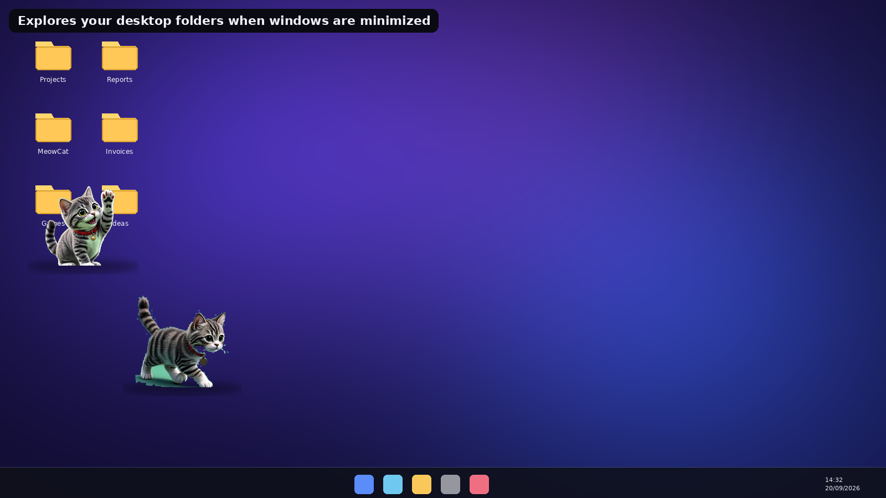
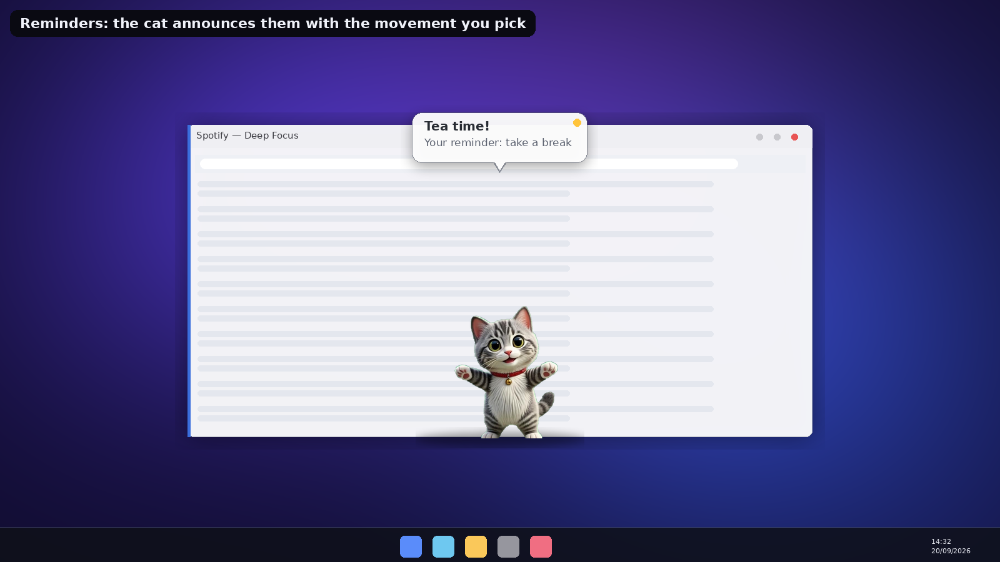

# 🐱 MeowCat

A **realistic, frame-animated desktop cat for Windows 11** that lives *on top of everything*.
The cat is **AI-generated photographic-quality art**: every action plays a hand-tuned sequence of
sprite frames (8-frame motion clips, 4-frame idle clips) with real-time **cross-fade interpolation**
at 60 FPS — so smooth it feels like a living animal, not a sprite sheet.

It walks along your taskbar and window borders, **hops onto the title bars of nearby windows and
strolls from window to window**, dances, naps, chases your cursor, plays with yarn — and when it
explores the **desktop wallpaper it wanders between your folder icons and scratches next to them**.
It even gets grumpy: **Angry Mode** makes it claw the screen, leaving realistic **broken-glass
cracks over everything you see** until it calms down.

It has its own **Cat Store** (6 breeds · accessories · emote packs · size — all with live animated
preview), a **fun-coin economy**, a **Reminders & Timers system** where the cat announces your
reminders with a speech bubble *and* the movement you picked for them, real recorded **cat sounds**
(meows, purrs, hisses, glass breaks), and ships as an **MSI installer** that creates a desktop
shortcut by default, with clean upgrade & uninstall support.

| | |
|---|---|
| **Stack** | C# / .NET 8 · WPF topmost overlay · WinForms tray · WiX/msitools MSI |
| **Art** | AI-generated photoreal kitten, 8-frame motion clips + 4-frame idle clips, cross-faded at 60 FPS |
| **AI brain** | Mood system (happiness / energy / boredom) with weighted autonomous actions |
| **Docs** | [docs/FEATURES.md](docs/FEATURES.md) · [docs/BUILD.md](docs/BUILD.md) · [docs/TESTING.md](docs/TESTING.md) |


---

## Highlights

| Feature | What it does |
|---|---|
| 🚫 **Never hidden bug fixed** | A native topmost enforcer re-asserts the cat (and glass overlay) above fullscreen apps — games, F11 browsers, slideshows — every scan tick without stealing focus |
| 🚶 **Tab-top strolling** | Walking near a window makes the cat auto-jump onto its top border, walk along it, then hop to the *nearest* neighbouring window, and continue |
| 🖥️ **Desktop explorer** | When all windows are minimized/closed, the cat strolls between your actual desktop folder icons (real shell icon positions, safe fallback grid) and scratches beside them |
| 😠 **Angry mode + glass cracks** | Click the grumpy cat → claw swipes stamp photoreal spiderweb shatters and gouges on a click-through overlay above every window; calm it down (treat/time) and every crack fades away |
| ⏰ **Reminders & timers** | Full manager UI: time, repeat (once/daily/weekly/every 30 min/hour), custom message, and **which movement the cat performs** when notifying. Speech bubble above the cat + tray balloon + real meow |
| ⚙️ **Settings** | Auto-start with Windows (HKCU Run key), sound on/off, volume, cat size, reminder popups — all persisted |
| 🛒 **Cat Store** | 6 breeds (grey tabby, orange tabby, tuxedo, calico, siamese, persian), hats/bows/glasses/scarf, 5 emote packs, 0.5×–2× size — every card has a live animated preview |
| 🪙 **Fun coins** | Earn by living, dancing, jumping, being petted; daily bonus; spend in the store |
| 🔊 **Real sounds** | Downloaded real meows (3 variants), purr, hiss, growl, glass break + synthesized footsteps/whoosh/coins |

## Screenshots

| Angry mode | Desktop stroll |
|---|---|
|  |  |

| Reminders | Cat Store |
|---|---|
|  |  |

---

## Install (Windows 11)

**Option A — MSI installer (recommended)**

1. Grab `MeowCat-2.0.0-x64.msi` (repo → `installer/`, or the GitHub Release).
2. Double-click → installs to `Program Files\MeowCat`, creates a **desktop shortcut by default**,
   a Start-Menu shortcut and an **Apps & Features** entry.
3. **Upgrade:** just run a newer MSI over it — the old version is removed automatically
   (MajorUpgrade). Same-version reinstalls are allowed.
4. **Uninstall:** `Settings ▸ Apps ▸ Installed apps ▸ MeowCat ▸ Uninstall`
   or `msiexec /x MeowCat-2.0.0-x64.msi`. Both shortcuts are removed too.

> Requires the **.NET 8 Desktop Runtime** (x64) — <https://dotnet.microsoft.com/download/dotnet/8.0/runtime>

**Option B — run from source**

```powershell
git clone https://github.com/mythos0/meow.git
cd meow
dotnet run --project src/MeowCat -c Release
```

**First steps:** right-click the cat (or the tray icon) → *Cat Store…*, *Reminders…*, *Settings…*,
*Make angry* (then click the cat — watch the glass). Two quick clicks on the cat = meow.

## Building

```powershell
dotnet test                       # 56 unit tests
dotnet publish src/MeowCat -c Release -r win-x64 --self-contained false
```

MSI: see [docs/BUILD.md](docs/BUILD.md) (Windows WiX or Linux msitools pipeline — the shipped
MSI is built with the msitools pipeline and verified with `msiinfo`).

## Repository layout

```
src/MeowCat.Core        # brain, economy, catalogs, reminders, jump physics (pure, testable)
src/MeowCat             # WPF overlay host, renderer, store/settings/reminder UIs, platform interop
tests/MeowCat.Tests     # 56 xunit tests (brain sims, economy, catalogs, reminders, platforms)
installer/              # MeowCat-2.0.0-x64.msi + WiX sources
scripts/                # asset pipeline (AI sheets → keyed frames), MSI build, screenshots
docs/                   # FEATURES / BUILD / TESTING + screenshots
art_raw/                # raw AI-generated sprite sheets (green/magenta screens)
```
